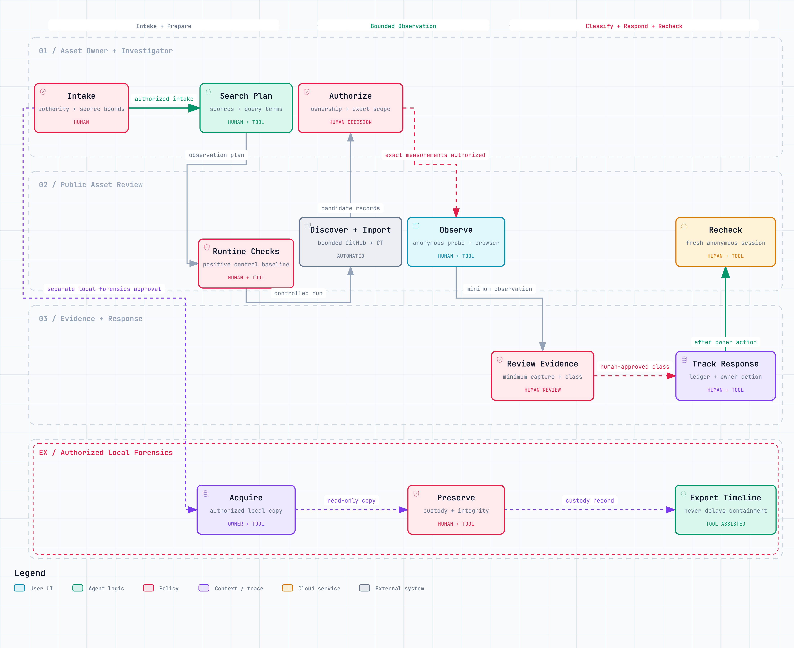

# Open-Detective


<p align="center">
  <a href="https://github.com/kindsusu/Open-Detective/actions/workflows/tests.yml"></a>
  <a href="pyproject.toml"></a>
  <a href="pyproject.toml"></a>
  <a href="pyproject.toml"></a>
  <a href="LICENSE"></a>
</p>

**조직의 공개 노출을 증거 중심으로 조사합니다.** Open-Detective는 외부에 공개된 자산을 찾고, 소유 관계를 확인할 수 있는 배포를 발견하며, 승인된 익명 접근을 관측하고, 우발적인 개인정보·기밀 콘텐츠 노출을 분류·격리·재측정하는 데 필요한 증거를 보존합니다.

범위 경계, 소유 증거, 명시적인 커버리지 공백, 최소 수집, 포렌식에 연결할 수 있는 로컬 증거 흐름을 갖춰 조사 기록을 검토 가능하게 만듭니다. 취약점 스캐너가 아니며, 발견한 비밀로 인증하거나 통제를 우회하거나 인접 레코드를 열거하지 않고 인터넷 전체를 확인했다고 주장하지 않습니다.

[저장소](https://github.com/kindsusu/Open-Detective) · [영문 문서](README.md) · [운영 흐름](docs/WORKFLOW.md) · [인터랙티브 흐름도](docs/workflow/open-detective.workflow.html) · [포렌식 흐름](ko/ops/forensics.md)

[](docs/WORKFLOW.md)

흐름도와 상세 문서는 영어로 제공합니다. HTML은 다운로드 후 브라우저에서 열 수 있으며, 일부 화면에서는 세로 스크롤이 필요합니다.

| 단계 | 다음 단계로 가는 조건 |
|---|---|
| Intake → 식별자·검색 계획 | 경계·제외·소유/에스컬레이션 참조를 로컬에 기록한다. |
| 계획 → control → 발견 | `doctor` parity와 필요한 fresh channel control을 확인한다. |
| 발견 → 익명 관측 | 소유 증거, exact HTTPS origin/path, 만료 전 `--scope`를 승인한다. |
| 관측 → 분류 → 격리 | 사람의 최소 증거 검토 뒤 소유자가 격리 조치를 결정하고 ledger에 기록한다. |
| 재측정 → 종료 | 모든 locator/alias의 새 익명 관측이 있어야 하며, 잔여 공백은 `partially_closed`다. |

수정본의 설치·적용 절차와 구현 범위: [IMPLEMENTATION.ko.md](IMPLEMENTATION.ko.md)

## 하는 일

- **범위와 소유:** 네트워크 관측 전에 승인된 경계와 소유 증거를 기록합니다.
- **노출 발견:** 지원하는 소유자 소스를 인벤토리로 수집하고, 기본 수집기가 지원하지 않는 소스는 출처를 남긴 정규화된 로컬 내보내기로 가져옵니다.
- **증거와 포렌식:** 관측이 뒷받침하는 내용만 분류하고, 보관 내용을 최소화하며, 승인된 로컬 보관 연속성과 타임라인 작업을 지원합니다.
- **격리와 재측정:** append-only 운영 대장에서 alias, 조치, 대조군, 새 관측을 추적합니다.

## 판정 모델

서로 독립적인 필드를 보존한다. HTTP 상태만으로 민감정보 노출이나 안전을 확정하지 않는다.

```text
access: BODY_SERVED | ACCESS_DENIED_OBSERVED | AUTH_REDIRECT_OBSERVED |
        NOT_FOUND_OBSERVED | INDETERMINATE
content: PUBLIC_UI | SENSITIVE_CONTENT_CONFIRMED | SENSITIVE_CANDIDATE |
         CLIENT_ENCRYPTED_OBSERVED | NOT_INSPECTED
confidence: confirmed | probable | unknown
workflow: candidate | ownership_pending | verification_pending | open |
          containment_pending | recheck_pending | partially_closed | closed | reopened
```

`BODY_SERVED + PUBLIC_UI`는 정상 로그인 페이지일 수 있다. `SENSITIVE_CONTENT_CONFIRMED`에는 실제 보호 값이나 필드의 최소 증거 참조, 익명 관측, 소유 증거가 필요하다. 이름 일치, 상태코드, 바이트 수, AI 점수, 도구 간 동의만으로는 부족하다.

## 설치와 실행

Python 3.11 이상이 필요하다. 브라우저 캡처는 선택 기능이다.

```bash
python -m pip install -e .
python -m pip install -e ".[browser]"
python -m playwright install chromium
open-detective --help
```

기본 명령은 `open-detective`입니다. 기존 `su-detect`와 `python -m sudetect` 진입점도 계속 지원하며 같은 CLI를 실행합니다.

루트 CLI는 `probe`, `browser`, `trace-assets`, `inventory`, `discover`, `github-discover`, `search-plan`, `channels-doctor`, `channel-discover`, `discovery-eval`, `asset-graph`, `asset-profile`, `asset-locations`, `forensics`, `locators`, `ledger`, `doctor`를 제공한다. 익명 측정 명령에는 `--scope`, 소유자 인벤토리와 passive import에는 명시적 `--scope-id`가 필요하다. 암묵적 측정 범위나 자동 헤더 재전송은 없다.

```bash
open-detective probe --scope scope.json https://app.example.test/
open-detective browser https://app.example.test/ --scope scope.json --duration 3
open-detective trace-assets --scope _local/scope.json --url https://app.example.test/public/ --output _local/case/asset-trace.json
open-detective inventory --provider vercel --scope-id TEAM --token-env VERCEL_TOKEN
open-detective inventory --provider import --scope-id TEAM --input inventory.json
open-detective discover --input candidates.json --scope-id TEAM
open-detective search-plan plan --output _local/plan.json --scope-id TEAM --company-en "<수행자 입력>"
open-detective doctor --reference .
open-detective channels-doctor --config _local/channels.json --scope _local/control-scope.json --output _local/channel-health.json --previous _local/channel-health.previous.json
open-detective github-discover --scope-id TEAM --account approved-account --channel-health _local/channel-health.json
open-detective search-plan run --plan _local/plan.json --locator-store _local/locators.sqlite --channel-health _local/channel-health.json
open-detective search-plan run-until-budget --plan _local/plan.json --locator-store _local/locators.sqlite --request-budget 60 --channel-health _local/channel-health.json
open-detective asset-profile --input _local/case/assets.json --output _local/case/asset-profile.json --markdown _local/case/asset-profile.md
open-detective asset-locations --input _local/case/asset-profile.json --locator-store _local/locators.sqlite --scope-id TEAM --output _local/case/private-locations.json
open-detective locators --store _local/locators.sqlite bind --scope-id TEAM --locator-ref "opaque:<id>" --scope _local/scope.json --db audit.sqlite --asset-id asset-1 --provider import
open-detective probe --scope _local/scope.json --locator-store _local/locators.sqlite --locator-scope TEAM --locator-ref "opaque:<id>"
open-detective ledger --db audit.sqlite due
```

`forensics`는 승인된 private local case와 소유자가 허가한 read-only export를 위한 별도 흐름이다. 이 `--case` authorization은 측정 `--scope`가 아니다. [ko/ops/forensics.md](ko/ops/forensics.md)를 읽는다. 인증·image 획득·법적 증거능력 판단을 하지 않으며, 없는 log에서 exfiltration 부재를 추론하지 않는다.

`asset-profile`도 오프라인 명령이다. 이미 승인된 로컬 capture의 제한된 bytes만 읽어 값 없이 구조 힌트와 후보 사업 데이터 범주를 만든다. locator를 가져오거나 공개 도달 가능성을 확정하거나 심각도를 부여하거나 민감 콘텐츠를 확정하지 않는다. manifest와 해석 규칙은 [ops/asset-profile.md](ops/asset-profile.md)를 본다.

`asset-locations`는 profile 또는 inventory report의 opaque 참조를 같은 `--scope-id`의 기존 로컬 locator store와 연결한다. exact URL은 새 private-local mapping에만 기록하고 네트워크 요청·index/file body 검사는 하지 않는다. 이 mapping에는 민감한 URL 구성 요소가 있을 수 있으므로 공개하지 않는다. [ops/asset-profile.md](ops/asset-profile.md)를 본다.

소유한 페이지를 제한된 `probe`로 관측한 뒤 관련 정적 파일도 확인해야 하면 `trace-assets`를 별도로 실행한다. 한 공개 HTML URL에서 시작하는 scope-bound 익명 GET 추적으로, scope가 허용한 명시적 HTML `script`와 명시적 GET JavaScript `fetch(...)` 참조만 따르며 전체 request·byte·duration·depth 예산과 중복 제거를 적용한다. JavaScript 실행, DOM 렌더링, 동적 endpoint 추측, 인증을 하지 않고 기존 `probe`나 `browser`의 동작도 바꾸지 않는다. 민감 콘텐츠 후보가 보이면 즉시 멈춘다. 따라서 inline client password literal 때문에 이후 JSON fetch 전에 중단될 수 있으며, 그 결과를 thin gate 전체를 추적한 것으로 말하면 안 된다. 결과는 content-profile 힌트와 coverage gap을 포함한 asset-linked report이며, `--locator-store`와 `--scope-id`를 함께 지정하면 최종 redirect의 exact location은 로컬에만 보관하고 report에는 opaque 참조만 남긴다. 자세한 규칙은 [ops/asset-trace.md](ops/asset-trace.md)를 본다.

`channel-discover`는 Cert Spotter CT와 수행자 지정 query-bound JSON export로 제한되며, `discovery-eval`과 `asset-graph`는 오프라인이다. [ko/ops/discovery-optimization.md](ko/ops/discovery-optimization.md)를 본다. 어느 것도 소유를 확정하거나 후보를 측정 target으로 바꾸지 않는다.

`tools/probe.sh`는 Python probe의 호환 래퍼다.

`doctor`는 읽기 전용이다. 명령이 실제로 불러온 runtime을 확인하고 검수한 source tree와 비교할 수 있다. 이 저장소를 수정하거나 push해도 이미 설치된 스킬/runtime은 갱신되지 않는다. 설치본이 갱신됐다고 판단하기 전에는 보고된 runtime root와 parity 결과를 확인한다.

## 범위 계약

정책은 실행 입력이다. 각 target에 소유자, 정확한 HTTPS origin, 허용 경로 접두사, 소유 증거를 적고 정책 만료 시각을 둔다. 와일드카드 origin, URL userinfo, HTTPS 이외 스킴, 만료된 정책은 거부한다. redirect와 broker가 처리하는 브라우저 요청을 전송 전에 검사한다. 소유자 API 인벤토리와 익명 표적 측정은 자격증명과 실행 환경을 분리한다.

```json
{"policy_id":"replace-with-approved-scope-id","expires_at":"2020-01-01T00:00:00Z","targets":[{"owner":"replace-with-owner-record-id","ownership_evidence":"replace-with-verified-asset-record-id","origin":"https://app.example","path_prefixes":["/"]}],"max_bytes":262144,"max_requests":20,"timeout":10,"max_redirects":5}
```

이 예시는 의도적으로 만료되어 있다. [examples/scope.example.json](examples/scope.example.json)을 ignored `_local/`로 복사하고 placeholder를 바꾼 뒤 승인된 미래 UTC expiry를 설정한다. 네트워크 명령 전에 [ko/ops/scope.md](ko/ops/scope.md)를 읽는다. 회사명, 도메인, 계정, 토큰은 로컬 입력에만 둔다.

## 작업 흐름

1. 발견 전에 로컬 audit intake에 제외와 증거, 조직 식별자, 관계사 경계, 제3자 상태, owner/escalation 참조, 추가 승인 행위를 기록한다. [examples/audit-intake.example.json](examples/audit-intake.example.json)과 [schemas/audit-intake.schema.json](schemas/audit-intake.schema.json)을 쓴다. 이는 실행 scope가 아니며 네트워크 권한을 주지 않는다. `third_parties.status="unknown"`은 기록된 공백이고, 제3자를 추측해 소유로 올리지 않는다.
2. 계약·자산·처리자/수탁자 대장의 관리자 export를 받고, 실행 scope를 승인한 다음 candidate를 import한다. owner-inventory 자격증명은 별도 권한 경로로 둔다.
3. intake에서 identifier와 오프라인 `search-plan`을 만든다.
4. `doctor --reference .`로 명령이 실제로 불러온 runtime root를 확인하고 검수한 `.` source tree와 비교한다.
5. `channels-doctor`로 승인된 fresh positive control을 실행한 뒤에만 `github-discover` 또는 `search-plan`을 실행한다. 대조군 성공은 회사 전체 발견 완료가 아니다.
6. 측정 전에 소유를 확증한다. 비공개 저장소의 공개 배포는 계속 남을 수 있다.
7. 제한된 익명 probe를 실행한다. 실패와 부분 캡처는 `INDETERMINATE`다.
8. 정적 HTML로 내용 질문에 답할 수 없을 때만 브라우저를 쓴다. `brokered_anonymous_browser`는 새 context와 정책 제한 transport broker로 승인된 GET document/script/stylesheet/XHR/fetch를 처리한다. browser credential, cookie, auth, referrer를 제거하고 Service Worker를 끈다. WebSocket server 연결을 막고 message는 local sink에서 버리며 popup을 닫고 download를 거부한다. 앞선 DOM 검토에서 candidate가 없을 때만 제한된 live `input`, `textarea`, `select` 값을 검사한다. canvas pixel, serialized snapshot 밖의 shadow DOM, JavaScript heap, interaction 이후 상태와 미지원 동작은 측정하지 않는다. password input은 `LOGIN_FORM_INDICATOR`일 뿐 `PUBLIC_UI`, 보호, 민감으로 자동 판정하지 않는다. dead proxy와 blocked host resolving으로 Chromium을 실행해 지원되는 page request가 broker를 거치게 한다. 이 통제는 observer 경계이며 OS firewall이나 전체 egress 보장이 아니다.
9. 최소 증거로만 내용을 확정한다. 개인정보나 사용 가능한 비밀이 보이면 중단한다. 승인된 소유자 측 확인 전까지 비밀의 실제 유효성은 unknown이다.
10. 긴급 격리, 로그 보존, 비밀 회전, 서비스 연속성을 함께 판단한다. SSO 뒤에서도 애플리케이션 권한 검사를 유지한다.
11. 원 URL과 알려진 모든 alias의 새 익명 observation, 대조군, 선언한 잔존 범위의 증거가 완료 조건을 충족할 때 종결한다. ledger asset과 alias를 opaque locator `target_id`, `policy_id`에 바인딩하고 불일치를 거부한다. 잔존을 확인하지 못했으면 `partially_closed`다. 종결 뒤 현재 `BODY_SERVED`, unknown/incomplete 결과, 같은 시각의 충돌 관측은 finding을 재개하거나 재검토 상태로 돌린다.

소유자 API는 모든 cursor를 끝까지 처리하고 권한·rate limit·truncation·시간 범위 공백을 기록한다. 정규화 JSON 가져오기는 source, retrieval time, owner scope, completeness를 보존한다. 채널 실패로 0행이 나온 것은 자산 0건이 아니다.

원본 사본 대신 마스킹된 증거 참조를 저장한다. query, fragment, userinfo, path, header, redirect, console, screenshot, trace 모두 토큰을 담을 수 있다. `0`과 `false`는 빈 값이 아니라 실제 값이다. 집계도 개인정보에서 파생되므로 범위, provenance, 접근통제가 필요하다.

SQLite 대장은 append-only observation/event, alias, control, proof reference, recheck, due queue를 기록한다. 변화 없는 관측은 조용히 보존하고 종결·재발·실패·사용자 조치 필요를 의미 있는 이벤트로 다룬다.

## 비공개 locator handoff와 발견 계획

정확한 URL은 소유자가 통제하는 로컬 locator store에 둔다. 공유 discovery 결과에는 `locator_ref`와 handoff state만 둔다. `ready`는 정확한 locator가 로컬 store에 있다는 뜻이고 `blocked`는 측정 target이 없다는 뜻이다. `probe`나 `browser`가 요청을 보내기 전에는 scope가 해석된 URL을 다시 허가해야 한다. recheck를 import하기 전에 승인된 ref를 asset에 바인딩해 ledger가 `target_id`, `policy_id`를 비교하게 한다.

`search-plan`은 제한된 재개 가능 manifest를 만든다. 수행자가 입력한 alias와 생성된 이름 변형을 구분하고, 실행하지 않은 작업은 `deferred`로 표시하며, 모든 필수 channel이 완료되거나 사유와 함께 `not_applicable`이 될 때까지 `PARTIAL`을 보고한다. `COMPLETE`는 선언한 plan과 channel coverage만 뜻하며 발견이 완전하다는 증거가 아니다. `discover`와 search-plan은 locator store로 정확한 후보 URL을 공유 plan/output 밖에 둘 수 있다. owner inventory의 locator-store handoff도 `--locator-store`로 같은 비공개-store 방식을 따르며 provider inventory metadata를 측정 승인으로 취급하지 않는다.

## 발견 채널 상태 대조군

`channels-doctor`는 로컬 positive control을 대상으로 scope 승인된 익명 관측을 새로 실행하고 config와 scope가 유효하면 report를 저장한다. JSON config는 `max_age_seconds`, 고유한 `channel_id`, `control_id`, `url`, 그리고 `expect.kind="json_pointer"` (`pointer`, `equals`) 또는 `expect.kind="body_contains"` (`value`)를 받는다. [examples/channel-health.example.json](examples/channel-health.example.json)을 참고한다. `/items/0/login`, `/items/0/full_name`처럼 구체적인 JSON-pointer 식별 검증을 우선하고, 일반적인 body marker는 false positive를 낼 수 있다. `OK`에는 HTTP 200, complete capture, 기대값 일치가 모두 필요하다. 예기치 않은 status, incomplete capture, mismatch는 `DEGRADED`, 도달 불가 또는 HTTP 404/410 control은 `DEAD`다. CLI는 바뀐 channel 행만 stdout에 내고 전체 report는 저장한다.

report는 형식과 freshness를 검사하는 로컬 운영 근거다. 전자서명이나 원격 attestation이 아니며 로컬 파일을 바꿀 수 있는 수행자에 대한 보안 경계도 아니다. 실제 GitHub 실행 때마다 현재 시각에 fresh control이 필요하다. repository 목록에는 `github-repositories`, 검색 seed에는 결과에서 repository 목록 확장이 가능하므로 `github-repositories`, `github-user-search`, `github-repository-search` 세 control이 모두 필요하다. API family 하나의 건강은 다른 family의 건강을 뜻하지 않는다. 외부 search-plan import에는 그 `observed_at` 시점에 유효한 channel-health가 있어야 하며, 그 뒤 만료되었다고 과거의 유효 import가 지워지지 않는다. synthetic test input은 실제 채널 검증이 아니다.

GitHub control은 `api.github.com` family에 맞춘다. 차례로 repository detail 또는 `/users|orgs/<owner>/repos`, `/search/users`, nonempty `q`가 있는 `/search/repositories`를 쓴다. 다른 endpoint의 일반 marker로 대신할 수 없고 detail control은 pagination·permission을 보장하지 않는다.

## 저장소 구성

| 경로 | 용도 |
|---|---|
| [SKILL.md](SKILL.md) | 설치되는 단일 스킬 진입점 |
| [ko/ops/scope.md](ko/ops/scope.md) | 안정 정책 규칙과 범위 스키마 |
| [ko/ops/discovery.md](ko/ops/discovery.md) | 소유자 인벤토리와 공개 발견 |
| [ko/ops/verify.md](ko/ops/verify.md) | 접근·내용 판정 |
| [ko/ops/triage.md](ko/ops/triage.md) | 심각도와 최소화 |
| [ko/ops/evidence.md](ko/ops/evidence.md) | 증거 위생과 provenance |
| [ko/ops/remediate.md](ko/ops/remediate.md) | 격리와 재측정 |
| [ko/ops/forensics.md](ko/ops/forensics.md) | 승인된 로컬 증거 흐름 |
| [ops/asset-profile.md](ops/asset-profile.md) | 값 없이 수행하는 오프라인 로컬 자산 프로파일링 |
| [ops/asset-trace.md](ops/asset-trace.md) | 제한된 정적 공개 자산 추적 |
| [examples/asset-profile-input.example.json](examples/asset-profile-input.example.json) | 최소 asset-profile 입력 예시 |
| [schemas/asset-profile-input.schema.json](schemas/asset-profile-input.schema.json) | asset-profile 입력 형식 |
| [ko/ops/discovery-optimization.md](ko/ops/discovery-optimization.md) | 제한된 adapter, 오프라인 평가, asset graph |
| [ko/surfaces/inventory.md](ko/surfaces/inventory.md) | 커버리지 체크리스트 |
| [schemas/audit-intake.schema.json](schemas/audit-intake.schema.json) | 발견 전 로컬 intake 형식 |
| [ko/assets/ledger-template.md](ko/assets/ledger-template.md) | 사람이 읽는 내보내기 |
| [tools/idgen.py](tools/idgen.py) | 오프라인 후보 생성기 |

영문 정책이 canonical이고 `ko/`는 동기화된 한국어 번역이다. `ko/SKILL.md`에는 frontmatter가 없어 중복 스킬로 등록되지 않는다.

## 검증과 라이선스

```bash
python -m unittest discover -s tests -v
```

테스트는 합성 입력을 쓰며 오프라인으로 실행한다. 통과는 배포나 실제 조직을 점검했다는 뜻이 아니다. 저장소의 [PolyForm Noncommercial License 1.0.0](LICENSE)를 유지한다. 허용 목적은 원문으로 판단한다. 그 범위를 벗어난 사용에는 licensor의 허가가 필요하며 제3자나 조직에 맞는 라이선스는 권리자와 법률 판단의 영역이다.

선택적인 locator store는 평문 SQLite다. 소유자가 접근을 제한하고 암호화한 저장 볼륨에 보관한다. opaque 참조가 원 URL을 암호화하지는 않는다. 로컬 검색 manifest에는 입력 회사명, 검색어, 공개 저장소 메타데이터가 들어 있으므로 마스킹 보고서로 간주해 공개하지 않는다.
